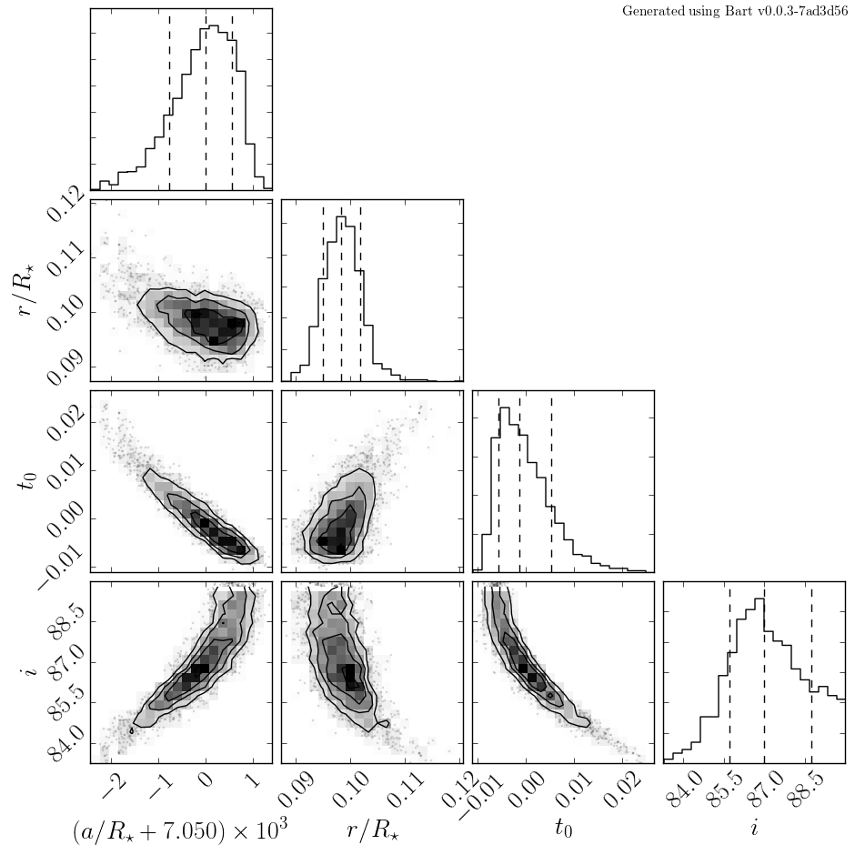

.. _model_building:
.. module:: bart
.. highlight:: python

Basic Model Building
====================

In this section, we'll discuss the model building syntax used by **Bart**. The
basic idea is that you start by declaring a full planetary system with the
number of planets and all the physical and observational parameters specified.
Then—starting from that point in parameter space—Bart can optimize or sample
the posterior probability distribution of any set of parameters given a set of
:class:`Dataset` objects. It is instructive to start by building a system and
generating fake data from the initial condition to see what it looks like. For
this purpose, we'll make a model that is roughly based on the planet
`Kepler-6b <http://kepler.nasa.gov/Mission/discoveries/kepler6b/>`_ discovered
by the *Kepler* satellite. To start we'll lay out the steps that are required
to generate a synthetic light curve and then—in the next section—we'll explain
how you would go about fitting for the parameters given this data.

*You can find the full source code for this example in the* `Bart source code
repository
<https://github.com/dfm/bart/blob/master/examples/docs/>`_.

The Star
--------

Kepler-6 is a metal-rich Sun-like star. The `Kepler-6b discovery paper
<http://arxiv.org/abs/1001.0333>`_ derives the following stellar parameters:

1. stellar mass :math:`M_\star = 1.209\,M_\odot`,
2. stellar radius :math:`R_\star = 1.391\,R_\odot`,
3. surface gravity :math:`\log_{10} g_\star (cgs) = 4.236`,
4. effective temperature :math:`T_\star = 5647\,K`, and
5. metallicity :math:`[\mathrm{Fe/H}] = +0.34`.

The metallicity, temperature and surface gravity suggest a particular shape of
the limb darkening profile in the Kepler band based on simulations of stellar
evolution and stellar atmospheres. To get this model using Bart, you run:

::

    from bart import kepler
    ldp = kepler.fiducial_ldp(teff=5647, logg=4.236, feh=0.34, bins=50)

This returns a :class:`LimbDarkening` object that follows the quadratic form
from `Sing (2009) <http://arxiv.org/abs/0912.2274>`_. You can also use the
values from `Claret & Bloemen (2011)
<http://adsabs.harvard.edu/abs/2011A%26A...529A..75C>`_:

::

    ldp = fiducial_ldp(teff=5647, logg=4.236, feh=0.34, bins=50, model="claret11")

*Note*: This will take a long time the first time you run this command because
it will first need to download the data tables from the paper. This also means
that the first time that you run this command, you'll need to be connected to
the internet. This is not true for the Sing (2009) model because it is
included with the default build of Bart.

Now that we've determined the limb darkening profile, we can then initialize
the :class:`Star`. To do this, run:

::

    import bart
    star = bart.Star(mass=1.209, radius=1.391, ldp=ldp)

The Planet
----------

The `same discovery paper <http://arxiv.org/abs/1001.0333>`_ also derives the
orbital and physical parameters of the planet Kepler-6b based on the light
curve and radial velocity measurements. These parameters are:

1. period :math:`P = 3.234723\,\mathrm{days}`,
2. scaled semi-major axis :math:`a/R_\star = 7.05`,
3. scaled planet radius :math:`R_p/R_\star = 0.09829`,

To initialize the :class:`Planet`, you can just add:

::

    a = 7.05 * star.radius
    Rp = 0.09829 * star.radius
    planet = bart.Planet(a=a, r=Rp)

At this point, let's check to make sure that the parameters are all consistent
with the measured period:

::

    print(planet.get_period(star.mass))

This should print something like ``3.23343650114`` which is close enough for
our purposes. It is sometimes useful, however, to initialize the planet first
and then set the star mass using the :func:`get_mstar` method on the
:class:`Planet` object to ensure that the data will have the right period.

Putting it All Together
-----------------------

The :class:`Star` and :class:`Planet` are brought together by adding them to a
:class:`PlanetarySystem`. You can also specify the inclination of the orbital
plane when creating the system. For Kepler-6b, the inclination was found to be
:math:`86.8^\circ`. Therefore, you can build the system as follows:

::

    kepler6 = bart.PlanetarySystem(star, iobs=86.8)
    kepler6.add_planet(planet)

and then plot the model light curve:

::

    import numpy as np
    import matplotlib.pyplot as pl

    t = np.linspace(-0.2, 0.2, 5000)
    pl.plot(t, kepler6.lightcurve(t))

This should result in a plot that looks something like this:

.. image:: ../_static/model_building.png

Generating Synthetic Data
-------------------------

Now, we'll generate some fake data that mimics long and short cadence light
curves observed by Kepler. Short cadence data are integrated for 54.2 seconds.
Including readout, the entire exposure lasts 58.9 seconds. The long cadence
data have 1626 second integrations in 1766 second exposures. To generate some
synthetic long cadence data for our Kepler-6 model, we can generate some
samples from the model at the correct cadence:

::

    lc_time = np.arange(0, 90., 1766 / (60. * 60. * 24.))
    lc_flux = kepler6.lightcurve(lc_time, texp=1626)

and then add some representative observational uncertainties:

::

    lc_err = 1.5e-3 * np.random.rand(len(lc_flux))
    lc_flux = lc_flux + lc_err * np.random.randn(len(lc_flux))

The same procedure for the short cadence data looks like:

::

    sc_time = np.arange(0, 90., 58.9 / (60. * 60. * 24.))
    sc_flux = kepler6.lightcurve(sc_time, texp=54.2)
    sc_err = 3e-3 * np.random.rand(len(sc_flux))
    sc_flux = sc_flux + sc_err * np.random.randn(len(sc_flux))

A plot of these synthetic datasets should look something like:

.. image:: ../_static/model_building_data.png

Fitting Light Curve Data
------------------------

Now we'll fit the synthetic data that we generated above using MCMC to show
that the code *actually works* and to demonstrate how you might go about
fitting a real light curve. The first step is to create a
:class:`Dataset` object containing the mock data and add it to the
:class:`PlanetarySystem`:

::

    lc = bart.Dataset(lc_time, lc_flux, lc_err, 1626)
    kepler6.add_dataset(lc)

For this demo, we'll just fit the long cadence dataset but you could
simultaneously fit the short cadence data by adding it in a similar way:

::

    sc = bart.Dataset(sc_time, sc_flux, sc_err, 54.2)
    kepler6.add_dataset(sc)

Then, you can choose which parameters you want to fit for. For now, let's just
fit for :math:`\ln\,a`, :math:`\ln\,R_p`, :math:`t_0` (the time of a reference
transit), and :math:`\cos\,i`. The first three parameters are properties of the
:class:`Planet` and the inclination (in this case) is a property of the
:class:`PlanetarySystem`. Adding these as fit parameters is simple:

::

    import bart.parameters as pars
    planet.parameters.append(pars.LogParameter(r"$\ln\,a$", "a"))
    planet.parameters.append(pars.LogParameter(r"$\ln\,r$", "r"))
    planet.parameters.append(pars.Parameter(r"$t_0$", "t0"))
    kepler6.parameters.append(pars.CosParameter(r"$\cos\,i$", "iobs"))

Now, the system has a new property called ``vector`` which is a NumPy array
with the current values of the fit parameters. It should currently be
something like:

::

    print(kepler6.vector)
    # [0.0558215, 2.28305053, -1.98981007, 0.]

It's important to note that the order of ``vector`` *is not* the order that
the parameters were added. Instead, it is is in the order:
:class:`PlanetarySystem`, :class:`Star`, :class:`Planet`, and
:class:`Dataset`. As a result, it's generally a bad idea to manually set the
value of ``vector``.

A general discussion of how you might go about initializing the parameters of
the fit is beyond the scope of this document so we'll simply perturb the true
values by a small amount and then run from there:

::

    planet.a *= 1 + 1e-3 * np.random.randn()
    planet.r *= 1 + 1e-2 * np.random.randn()
    planet.t0 = 1e-3 * np.random.randn()
    kepler6.iobs += np.random.rand() - 0.5

